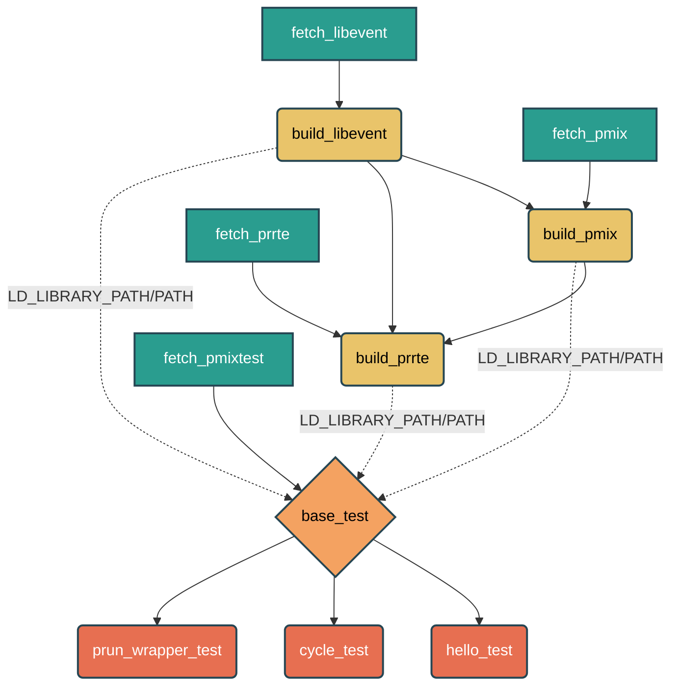

# PMIx ReFrame Test Suite

A [ReFrame](https://reframe-hpc.readthedocs.io/en/stable/)-based testing framework for the **PMIx (Process Management Interface for Exascale)** library and runtime environment. This test suite automatically builds all dependencies from source and validates the PMIx stack through a series of functional tests.

## Overview

**What does this do?**

This test suite:
- Automatically downloads and builds three core components from source: `libevent`, `PMIx`, and `PRRTE`
- Ensures all components are built with compatible versions and linked correctly
- Validates the complete PMIx stack by running functional tests


## Project Structure

### File Organization

| File | Purpose |
|------|---------|
| `libevent_build_class.py` | Download and build the `libevent` library (base dependency) |
| `pmix_build_class.py` | Download and build `PMIx` (linked against `libevent`) |
| `prrte_build_class.py` | Download and build `PRRTE` (linked against `libevent` and `PMIx`) |
| `build_pmix_test.py` | Build test binaries (`hello_world`, `cycle`, `prun-wrapper`) |
| `run_pmix_test.py` | Main ReFrame test file - run all tests |
| `sysconfig.yaml` | ReFrame system configuration for your HPC cluster |
| `setup_env.sh` | Optional environment setup script |

### Build Dependency 

The test suite follows a strict build order to ensure all dependencies are satisfied:



### Installation

1. **Clone the repository:**
   ```bash
   git clone https://github.com/NiccoloTosato/pmix-reframe-suite.git
   cd pmix-reframe-suite
   ```

2. **Create and activate a Python virtual environment:**
   ```bash
   python3 -m venv .venv
   source .venv/bin/activate
   ```

3. **Install ReFrame:**
   ```bash
   pip install reframe-hpc
   ```

4. **Configure your system** (edit `sysconfig.yaml`):
   Update the system name, partition, and access credentials to match your HPC cluster.

## PMIx Python Test Coverage

This branch also includes ReFrame tests for the PMIx Python bindings.

These tests use a Python controller to connect to a PRRTE DVM through PMIx and spawn simple sleeper jobs. The sleeper jobs start, sleep briefly, print DONE, and exit. This keeps the tests focused on launch, placement, completion, and regression behavior.

### PMIx Python tests

| Test file | Purpose |
|----------|---------|
| `pmix_python_binding/reframe/pmix_python_scaling_test.py` | Single-node PMIx Python process scaling |
| `pmix_python_binding/reframe/pmix_python_scaling_multinode_test.py` | Multi-node PMIx Python spawning |
| `pmix_python_binding/reframe/pmix_python_mapping_ppr_node_test.py` | PPR node mapping through PMIx Python |
| `pmix_python_binding/reframe/pmix_python_worker_threads_compat_test.py` | Concurrent spawn submission from Python worker threads |
| `pmix_python_binding/reframe/pmix_python_targeted_compat_test.py` | Requested host targeting through PMIX_HOST |
| `pmix_python_binding/reframe/pmix_python_mixed_thread_compat_test.py` | Mixed job sizes and slot tracking |

### PMIx Python portability

The PMIx Python tests use PMIX_PYTHON when it is set. This lets a CI runner, service account, or another user provide a different Python interpreter with the PMIx bindings installed.

Example:

    export PMIX_PYTHON=/path/to/python-with-pmix-bindings

If PMIX_PYTHON is not set, the tests fall back to the development Python path used during initial Frontier validation.


## Running the Tests

### Quick Start

Run all tests with default versions:
```bash
source setup_env.sh
reframe -C ./sysconfig.yaml -c run_pmix_test.py --system=odo:batch -r
```

### With Custom Component Versions

Specify different versions for any component:
```bash
reframe -C ./sysconfig.yaml -c run_pmix_test.py \
  --system=odo:batch \
  -S fetch_pmix.version="6.1.0" \
  -S fetch_prrte.version="4.1.0" \
  -S fetch_libevent.version="2.1.12" \
  -r
```

### Environment Variables

The `setup_env.sh` script sets useful ReFrame environment variables:
- `RFM_KEEP_STAGE_FILES=1`: Preserves build artifacts for debugging
- `RFM_CONFIG_FILES`: Points to the system configuration
- `RFM_PREFIX`: Output directory for test results

You can also set these manually before running tests.

## Execution Flow

The test suite executes in the following phases:

### Phase 1: Download
- `fetch_libevent` downloads `libevent` source
- `fetch_pmix` downloads `PMIx` source
- `fetch_prrte` downloads `PRRTE` source
- `fetch_pmixtest` clones the `pmix-tests` repository

### Phase 2: Build
- `build_libevent` compiles `libevent` and installs to staging directory
- `build_pmix` compiles `PMIx`, explicitly linking against the built `libevent`
- `build_prrte` compiles `PRRTE`, linking against both built `libevent` and `PMIx`

### Phase 3: Test Preparation
- `build_hello_world`, `build_cycle`, `build_prun_wrapper` build test binaries
- Environment variables (`PATH`, `LD_LIBRARY_PATH`) are configured to use the locally built libraries

### Phase 4: Test Execution
- Each test runs in the configured environment
- Tests validate the PMIx stack functionality

